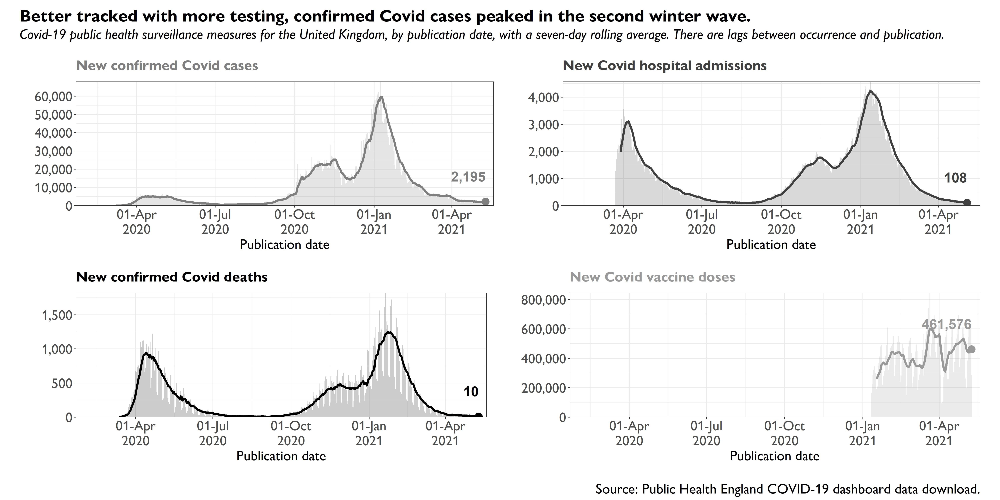

```{r setup, include=FALSE}
knitr::opts_chunk$set(echo = TRUE)
```

## Code and graphs

Each link will take to the GitHub repository, where there is the R code and spreadsheets used to create the original graphs.

These graphs are in grey-scale. There are also some colour versions created for presentations by the authors. In addition, there is code for graphs cut from published versions of the book. In the book itself, graphs were remade in the house style, so the appearance differs.

```{r, echo = FALSE}

```

- **Chapter 1:** [Introduction](https://github.com/covid-by-numbers/covid-by-numbers.github.io/tree/main/code/01-INT)
- **Chapter 2:** [How did the pandemic develop?](https://github.com/covid-by-numbers/covid-by-numbers.github.io/tree/main/code/02-SPR)
- **Chapter 3:** [How infectious is SARS-CoV-2?](https://github.com/covid-by-numbers/covid-by-numbers.github.io/tree/main/code/03-IFC)
- **Chapter 4:** [What is the risk from new variants?](https://github.com/covid-by-numbers/covid-by-numbers.github.io/tree/main/code/04-VAR)
- **Chapter 6:** [How many cases have been found?](https://github.com/covid-by-numbers/covid-by-numbers.github.io/tree/main/code/06-CAS)
- **Chapter 7:** [How many people have been infected with SARS-CoV-2?](https://github.com/covid-by-numbers/covid-by-numbers.github.io/tree/main/code/07-SAR)
- **Chapter 8:** [How ill do people get with Covid?](https://github.com/covid-by-numbers/covid-by-numbers.github.io/tree/main/code/08-ILL)
- **Chapter 9:** [What happened in hospitals?](https://github.com/covid-by-numbers/covid-by-numbers.github.io/tree/main/code/09-HOS)
- **Chapter 10:** [How good are the treatments for Covid?](https://github.com/covid-by-numbers/covid-by-numbers.github.io/tree/main/code/10-TRT)
- **Chapter 11:** [How many people have died from Covid?](https://github.com/covid-by-numbers/covid-by-numbers.github.io/tree/main/code/11-DEA)
- **Chapter 12:** [How lethal is SARS-CoV-2?](https://github.com/covid-by-numbers/covid-by-numbers.github.io/tree/main/code/12-DAN)
- **Chapter 13:** [Who has been most at risk from Covid?](https://github.com/covid-by-numbers/covid-by-numbers.github.io/tree/main/code/13-RSK)
- **Chapter 14:** [How do we compare countries?](https://github.com/covid-by-numbers/covid-by-numbers.github.io/tree/main/code/14-COU)
- **Chapter 15:** [How does the impact of Covid compare with other historical harms?](https://github.com/covid-by-numbers/covid-by-numbers.github.io/tree/main/code/15-COM)
- **Chapter 16:** [What is the effect of measures against the spread of SARS-CoV-2?](https://github.com/covid-by-numbers/covid-by-numbers.github.io/tree/main/code/16-NPI)
- **Chapter 17:** [What are the collateral effects of the measures against Covid?](https://github.com/covid-by-numbers/covid-by-numbers.github.io/tree/main/code/17-COL)
- **Chapter 18:** [How has behaviour changed during the pandemic?](https://github.com/covid-by-numbers/covid-by-numbers.github.io/tree/main/code/18-BEH)
- **Chapter 19:** [What has happened to mental health and well-being?](https://github.com/covid-by-numbers/covid-by-numbers.github.io/tree/main/code/19-WEL)
- **Chapter 21:** [What has been the effect on the economy?](https://github.com/covid-by-numbers/covid-by-numbers.github.io/tree/main/code/21-ECO)
- **Chapter 22:** [How effective are the vaccines?](https://github.com/covid-by-numbers/covid-by-numbers.github.io/tree/main/code/22-VAC)
- **Chapter 24:** Who has been getting the vaccines? (in the same folder as [Chapter 7](https://github.com/covid-by-numbers/covid-by-numbers.github.io/tree/main/code/07-SAR))
- **Chapter 25:** [How far apart should the vaccines be given?](https://github.com/covid-by-numbers/covid-by-numbers.github.io/tree/main/code/25-DIN)
