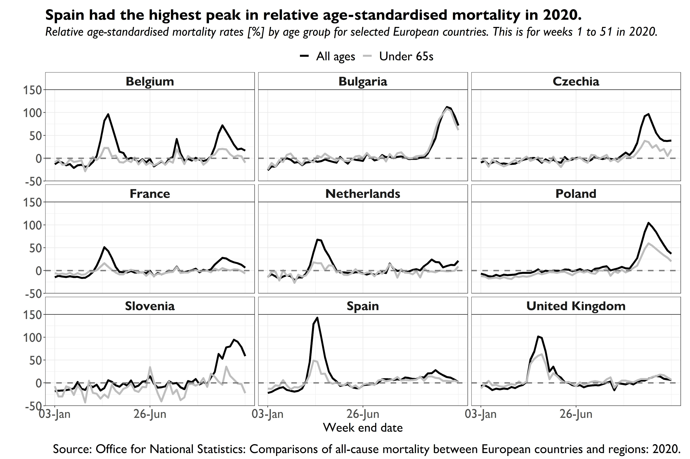

```{r setup, include=FALSE}
knitr::opts_chunk$set(echo = TRUE)
```

This page notes errors and make corrections in the book. If you found an error, please contact us on covid-by-numbers@outlook.com.

All apologies in advance.

## Errors

- **Page 81**: The footnote starts: "Between 1 August 2020 and 31 March 2020". The intended period was: "Between 1 August 2020 and 31 March 2021".
- **Page 107**: In the table, the peak date of occurrence is written as "19th January 2020". The intended date was: "19th January 2021".
- **Page 140**: In Figure 14-2, the United Kingdom lines (I) are incorrectly elevated. That figure should look like:

```{r, echo = FALSE}

```

- **Page 148**: The footnote refers to the period: "up to 14 May 2020". That date should be: "14 May 2021".
- **Page 296**: In the index, "science Media Centre" is missing a capital on the first word. It should read: "Science Media Centre".
