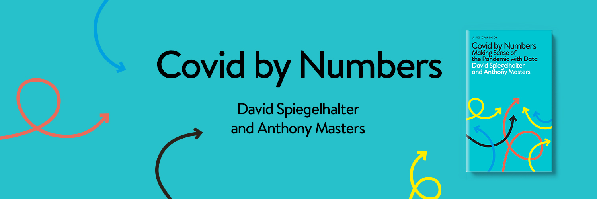
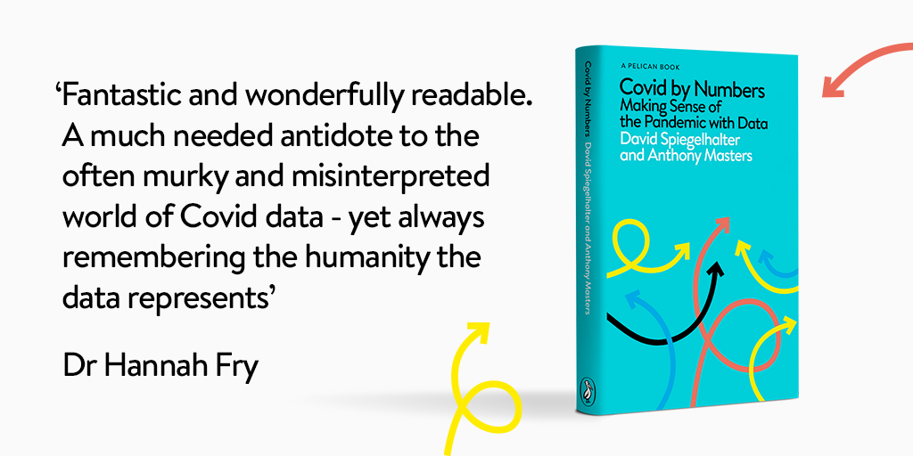

```{r setup, include=FALSE}
knitr::opts_chunk$set(echo = FALSE)
```

```{r}

```

This is the accompanying website for [Covid by Numbers](https://www.penguin.co.uk/books/446/446585/covid-by-numbers/9780241547731.html), published by Penguin Random House on 7th October 2021. This book was written by David Spiegelhalter and Anthony Masters.

This book is to help you understand the pandemic statistics you see and hear in the news. The role of this website is to:

- Host the code and spreadsheet for the graphs produced in R.
- Provide code for selected updated graphs.
- Correct any errors in the book's text.
- Provide full end notes for the book.

If we have made an error in the book, please contact the authors:

- covid-by-numbers@outlook.com.

## Where to Buy

The hardback version of the book is available from:

- [Amazon](https://www.amazon.co.uk/gp/product/0241547733?tag=prhmarketing2552-21);
- [Blackwells](https://blackwells.co.uk/bookshop/product/9780241547731?a_aid=prh);
- [Bookshop.org](https://uk.bookshop.org/books/covid-by-numbers-making-sense-of-the-pandemic-with-data/9780241547731);
- [Foyles](https://www.foyles.co.uk/witem/medical-veterinary/covid-by-numbers-making-sense-of-the-pa,david-spiegelhalter-anthony-masters-9780241547731);
- [Hive](https://www.hive.co.uk/Product/David-Spiegelhalter/Covid-By-Numbers--Making-Sense-of-the-Pandemic-with-Data/26111643);
- [Waterstones](https://www.waterstones.com/book/9780241547731);
- [WHSmith](https://www.whsmith.co.uk/products/covid-by-numbers-your-questions-answered-pelican-books/david-spiegelhalter/anthony-masters/hardback/9780241547731.html).

An e-book copy is available from:

- [Amazon](https://www.amazon.co.uk/Kindle-eBooks-books/b/ref=short_url_ebooks?ie=UTF8&node=341689031&tag=prhmarketing2552-21);
- [Apple Books](https://books.apple.com/gb/book/covid-by-numbers/id1566245851);
- [Kobo](https://www.kobo.com/gb/en/ebook/covid-by-numbers).

## Reviews

```{r}

```

**Tom Chivers** (columnist and co-author of 'How to Read Numbers'): A clear, concise statistical journal of the plague year. If you want to understand the numbers behind the virus that stopped the world, you ought to read this book.

**Dr Hannah Fry** (mathematician, broadcaster, and author of 'Hello World'): Fantastic and wonderfully readable. A much needed antidote to the often murky and misinterpreted world of Covid data, explained in a straightforward and clear way - yet always remembering the humanity the data represents.

**Tim Harford** (host of BBC's More or Less and author of 'How to Make the World Add Up'): I couldn't imagine a better guidebook for making sense of a tragic and momentous time in our lives. Covid by Numbers is comprehensive yet concise, impeccably clear and always humane.

**Prof Oliver Johnson** (University of Bristol mathematics professor in [The Guardian](https://www.theguardian.com/books/2021/sep/30/covid-by-numbers-review-how-to-make-sense-of-the-statistics)): If journalists, politicians and the public were all provided with a copy then the debate would be vastly better informed, with much more light than heat.

**Prof Adam Kucharski** (LSHTM professor and author of 'The Rules of Contagion in [The Lancet](https://www.thelancet.com/journals/lancet/article/PIIS0140-6736(21)02128-0/fulltext)): The result is a valuable overview of COVID-19 statistics and how to navigate them. Rather than just quoting numbers, Spiegelhalter and Masters discuss how to think about epidemic data.

## Acknowledgments {.appendix}

This is a website made with the [distill package](https://rstudio.github.io/distill/). Many thanks to [Rhian Davies](https://github.com/StatsRhian) (Jumping Rivers) for her help in building this website.
