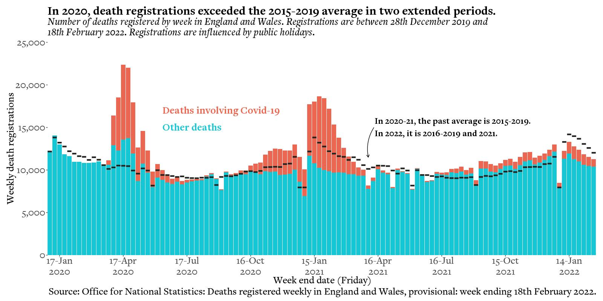
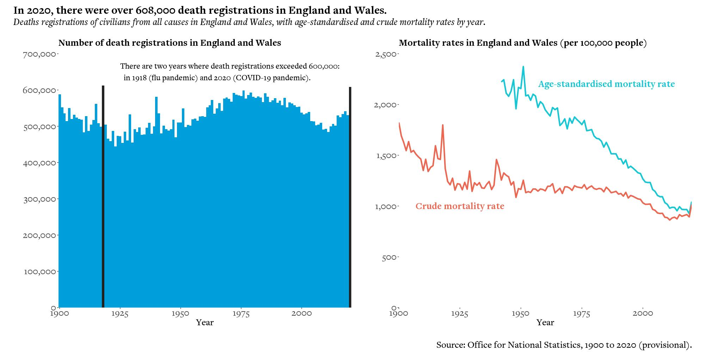

```{r setup, include=FALSE}
knitr::opts_chunk$set(echo = FALSE)
```

## Updated graphs

The code for these graphs is available in the [GitHub repository](https://github.com/covid-by-numbers/covid-by-numbers.github.io/tree/main/code/00-UPD). These versions have been updated in the font and colours associated with the book. Some graphs also show more recent statistics. The latest update was on 3rd March 2022.

Figure 3-3:

```{r, echo = FALSE}

```

Figure 11-2:

```{r, echo = FALSE}

```

Figure 15-2:

```{r, echo = FALSE}

```

Figure 19-1:

```{r, echo = FALSE}

```
